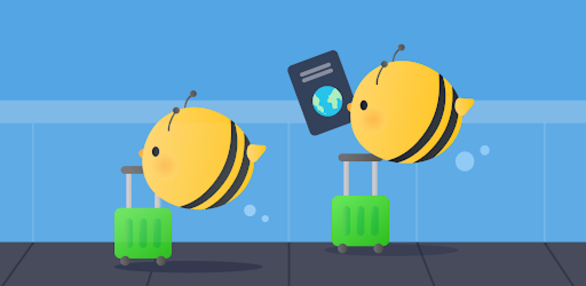
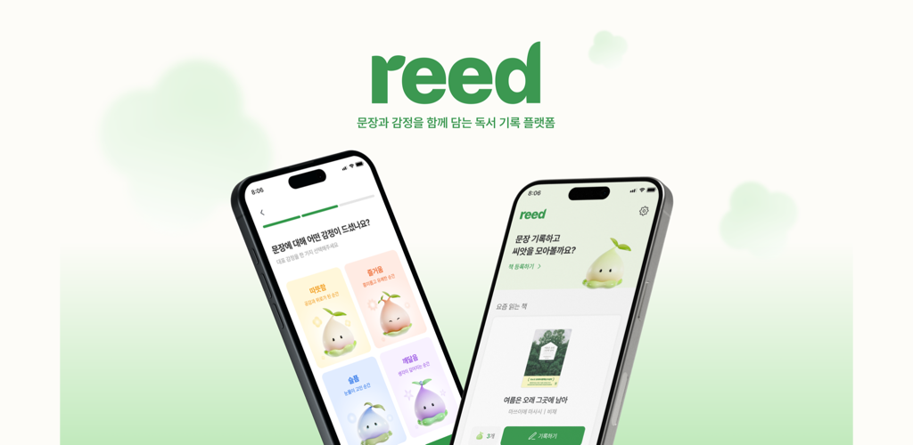
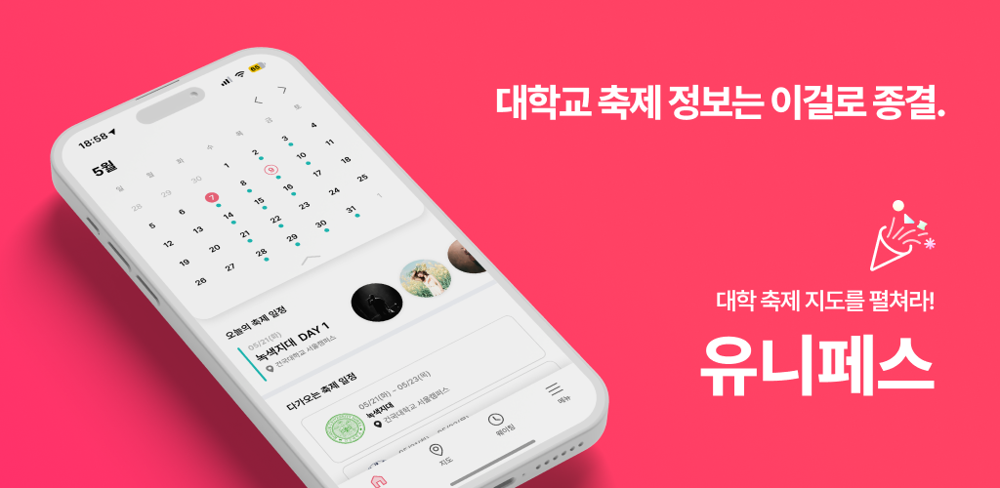
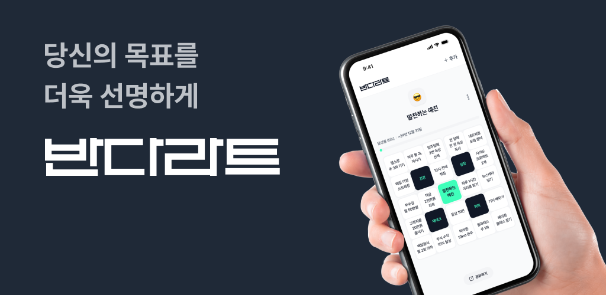
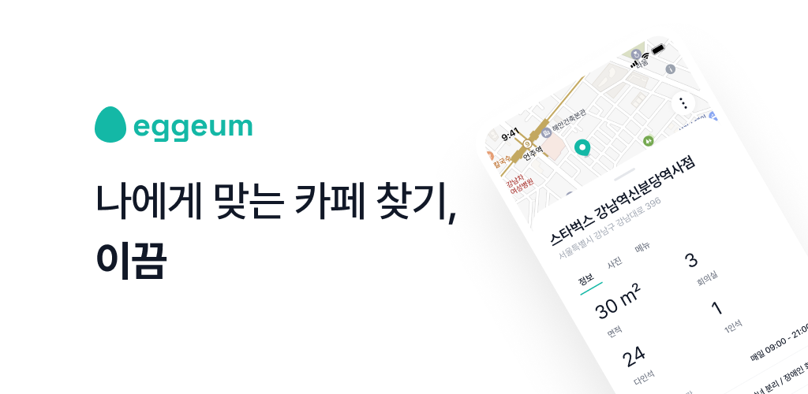
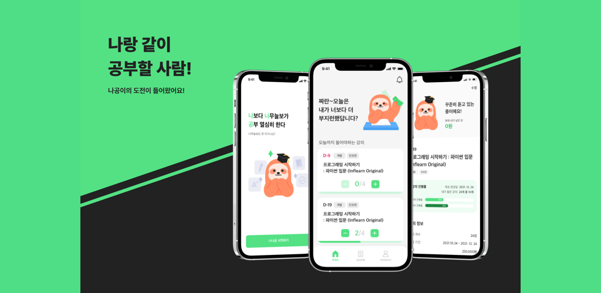

# 이지훈 Android Developer Portfolio

<table>
  <tr>
    <td><strong>Phone</strong> 010-2010-3068</td>
    <td><strong>Email</strong> mraz3068@gmail.com</td>
  </tr>
  <tr>
    <td><strong>GitHub</strong> <a href="https://github.com/easyhooon">github.com/easyhooon</a></td>
    <td><strong>Tech Blog</strong> <a href="https://velog.io/@mraz3068">velog.io/@mraz3068</a></td>
  </tr>
  <tr>
    <td><strong>Resume</strong> <a href="https://github.com/easyhooon/resume/blob/main/RESUME.md">RESUME.md</a></td>
    <td><strong>LinkedIn</strong> <a href="https://www.linkedin.com/in/easyhooon/">linkedin.com/in/easyhooon</a></td>
  </tr>
</table>

## Overview

출시한 **Android 앱 9개와 iOS 앱 1개**를 중심으로, 제품을 개발·운영하며 기능 구현, 구조 설계, 도구 개발로 문제를 해결한 경험을 정리했습니다.

제품 요구사항을 구현하고 서비스를 운영하며 마주한 상태 관리와 의존성, 화면 전환, 플랫폼 확장 문제를 풀어왔습니다. 기술 선택은 해결할 문제와 프로젝트 상황을 기준으로 판단했으며, 그 경험을 라이브러리 개발과 오픈소스 기여로 확장했습니다.

## Team Projects

### YeoBee(여비) - 여행 비용 기록과 정산을 돕는 여행 가계부 2026.01 ~

  

여행 동행자와 함께 지출을 기록하고 공동경비·개인경비·정산 내역을 관리하는 서비스

**Android 개발** · [Play Store](https://play.google.com/store/apps/details?id=com.yeobee)

- **Metro 전환**: 기존 Hilt의 graph·scope·qualifier 기반 의존 구조를 유지하면서 KSP/KAPT 코드 생성 경로를 제거하기 위해, Kotlin compiler plugin의 FIR/IR에서 직접 코드를 생성하는 Metro를 선택하고 DI 설정 재정의
- **Navigation3 도입**: 딥링크·앱 내부 화면 전환·비로그인·warm start마다 달라지는 stack 구성을 하나의 상태에서 관리하기 위해, back stack을 앱 상태로 직접 다루는 Navigation3를 선택. 진입 경로별 stack 구성과 초대 수락·오류 처리 흐름 일원화
- **초대 수락 흐름 재설계**: 딥링크·코드 입력·비로그인·warm start에서도 초대 만료·중복 참여·정원 마감·여행 삭제를 같은 규칙으로 검증하고, 이름 선택이 끝난 시점에만 최종 수락 API를 호출하도록 구성해 중복·잘못된 참여 요청 방지
- **AI 에이전트 중심 개발 워크플로 설계**: Figma MCP, Task·Lesson 기록, AI가 참조할 개발 문서, `start-workflow` 스킬과 PR Review Bot을 연결해 이슈 생성부터 구현·검증·PR까지 자동화. 기능 구현 대부분은 에이전트에 맡기고 요구사항 분해·컨텍스트 설계·변경 리뷰·실행 검증에 집중
- **배포 자동화**: QA 배포와 Play Store 운영 배포 때마다 빌드·업로드·versionCode·알림 단계를 반복해야 했던 흐름을 줄이기 위해 Firebase App Distribution 배포 스크립트와 versionCode override를 포함한 GitHub Actions workflow를 구성하고 Discord 알림까지 연결

> **배운 점**
>
> - **작업 컨텍스트 구조화**: 작업이 길어질수록 AI가 진행 맥락과 완료 조건을 놓치는 문제를 줄이기 위해 할 일을 Task로 나누고, Figma MCP와 개발 문서로 디자인·모듈 구조·상태 관리 규칙을 제공. AI의 작업 진행 능력은 긴 프롬프트보다 필요한 맥락을 적절한 시점에 제공하는 구조에 더 크게 좌우됐음
> - **실패를 외부 기억으로 축적**: 리뷰와 작업 실패의 원인·수정 기준을 Lesson 패턴으로 남기고 이후 Task와 개발 문서에서 다시 참조하도록 구성. 한 번의 수정으로 끝내지 않고 이전 시행착오를 다음 작업의 입력으로 전환
> - **구현·검증 루프 자동화**: 이슈 생성, 브랜치 분리, 구현, 빌드·테스트, 커밋, PR 생성을 `start-workflow` 스킬로 연결하고 PR Review Bot의 피드백을 Lesson과 문서에 반영. 코드 생성뿐 아니라 검증과 피드백까지 닫힌 루프로 만들어야 안정적으로 작업을 위임할 수 있음을 확인

### Reed(리드) - 문장과 감정을 함께 담는 독서 기록 2025.05 ~ 2026.04

  

독서 중 만난 문장과 감정을 함께 기록하고 공유하는 서비스

**Android 개발** · **YAPP 26기 최우수상** · [GitHub](https://github.com/YAPP-Github/Reed-Android) · [기술 기록](https://github.com/YAPP-Github/Reed-Android#troubleshooting)

- **Circuit 도입**: 여러 화면의 상태 생성과 이벤트 처리를 동일한 계약으로 관리하기 위해 Presenter와 UI의 역할을 프레임워크 수준에서 분리하는 Circuit(MVI)을 선택. Presenter는 상태 생성·이벤트 처리를, UI는 상태 소비·이벤트 전달을 담당하도록 해 화면 구조 표준화
- **기술 도입 리딩**: Circuit 적용 전 기대 효과와 제약, 일회성 이벤트 처리의 우려를 팀에 공유하고 Presenter·UI·Screen의 책임 규칙을 함께 합의해 구조 전환의 기준 정립
- **타입 기반 화면 전환**: 기록·감정 데이터와 동적 복귀 경로를 안전하게 함께 전달하기 위해 Screen 기반 Circuit Navigation을 선택. 화면 인자를 타입으로 정의해 route·custom `NavType` 보일러플레이트 제거
- **Pagination 적용**: 검색 결과 전체를 기다리는 초기 대기를 줄이기 위해 페이지 단위 요청 방식을 구현하고 첫 페이지부터 화면에 표시
- **로그인 전 탐색 지원**: 가입 전에 서비스의 기록 방식을 확인할 수 있도록 Guest Mode로 주요 기능 체험 경로 제공
- **기록 카드 공유**: Compose UI를 이미지로 바로 공유할 수 없어 `GraphicsLayer`로 화면을 `Bitmap`으로 변환하고, 완성한 도서 기록 카드의 저장·공유 지원
- **OCR 문장 입력**: 책 속 문장을 직접 옮겨 적는 부담을 줄이기 위해 촬영 이미지를 Google Cloud Vision API로 텍스트로 변환하고, 인식 결과를 기록 템플릿에서 바로 편집·저장할 수 있도록 연결

> **배운 점**
>
> - **일회성 이벤트 모델링**: 이벤트 유실을 피하려 State로 관리했지만, 소비 상태를 초기화하지 않으면 화면 복원 시 같은 스낵바가 다시 노출됐음. 자료형보다 이벤트의 유실·소비·복원 시점을 먼저 정의하는 것이 중요
> - **화면 이탈과 코루틴 취소**: 화면 이탈로 Presenter의 작업이 취소되는 것은 실패가 아니라 생명주기에 따른 정상 종료일 수 있었음. `CancellationException`을 일반 오류와 구분하며 정상 취소와 실제 실패를 나누는 오류 처리 기준 정립
> - **모듈 간 의존성 경계**: Hilt에서 Metro로 전환하던 중 public API에 노출된 `Preferences` 의존성을 `implementation`으로 숨겨 컴파일러가 타입을 해석하지 못하는 문제를 겪음. 최소 재현 프로젝트로 원인을 좁히며 `api`와 `implementation`의 선택 기준은 관례가 아니라 외부에 노출되는 타입 경계임을 확인

### 유니페스 : 대학 축제의 지도를 펼쳐라! 2024.03 ~ 2025.10

  

대학 축제 통합 플랫폼으로 지도 기반 행사 정보, 부스 웨이팅, QR 인증 이벤트, 알림 기능을 제공하는 서비스

**Android 개발** · [Play Store](https://play.google.com/store/apps/details?id=com.unifest.android) · [GitHub](https://github.com/Project-Unifest/unifest-android) · [기술 기록](https://github.com/Project-Unifest/unifest-android#article)

고려대·가천대·상명대·한국교통대 축제 공식 앱 선정, Play Store 다운로드 **2,000+**, 축제 운영 기간 Android/iOS 통합 최고 **WAU 5,000+**

- **지도 클러스터링**: 축제 현장에 밀집된 부스·행사 마커를 제한된 화면에서 구분하기 위해 Naver Map Compose 기반 지도에 클러스터링을 적용. 줌 레벨에 따라 마커를 묶고 펼쳐서 표시해 지도 정보 가독성 개선
- **MVI 기반 모듈화**: 축제 기능별 상태와 이벤트를 분리해 관리하기 위해 구글 권장 아키텍처와 MVI 패턴을 선택. 화면 상태와 이벤트 처리 책임을 기능 모듈 안으로 분리
- **Type-safe 중첩 Navigation**: 문자열 route와 argument key 불일치를 줄이기 위해 sealed route 기반 Navigation으로 전환하고, 중첩 graph에서도 data class property와 `SavedStateHandle` key를 연결해 부스 상세·위치 화면의 인자 전달 규칙 정리
- **QR 기반 현장 인증**: 부스의 QR 스캔 결과를 참여 상태에 연결해 현장 이벤트 인증을 앱 안에서 완료
- **탐색 상태 복원**: 앱 재실행 후에도 관심 축제·부스와 사용자 설정을 유지하도록 Room과 DataStore에 데이터 성격별로 저장
- **운영 중 버전·예외 대응**: 축제 기간에 지원 버전 기준을 새 빌드 없이 바꿀 수 있도록 Firebase Remote Config로 원격 관리하고, API 에러 코드를 상황별 안내 흐름에 연결
- **Room Migration Test**: 스키마 변경 후에도 기존 관심 축제·부스 데이터가 유지되는지 확인하기 위해, 이전 스키마에서 현재 버전까지의 마이그레이션 테스트 구성

> **배운 점**
>
> - 신규 기능을 배포할 때는 변경된 코드의 동작뿐 아니라 이전 버전에서 쌓인 사용자 데이터가 새 스키마에서도 유지되는지 함께 검증해야 했음
> - 로그인 없이 SSAID로 사용자를 식별해 진입 장벽을 낮췄지만, 동일 기기에서도 앱 서명 키가 달라지면 값이 바뀌어 개발 머신별 QA 데이터가 분리되는 문제를 겪음. 플랫폼 식별자는 반환값만 믿지 않고 빌드 변형·서명·재설치 조건까지 확인해야 함을 배움
> - `derivedStateOf`를 막연히 재구성 최적화 도구로 사용했다가 일반 변수가 Snapshot 추적 대상이 아니어서 웨이팅 버튼이 갱신되지 않는 문제를 만남. 최적화 API를 적용하기 전에 어떤 상태가 어디서 관찰되고 언제 다시 계산되는지 먼저 확인하게 됨

### I'Lab - 나만의 AI 프로필 연구소 2024.01 ~ 2024.04

  

생성형 AI 기반으로 취향에 맞는 프로필 사진을 만들고 공유할 수 있는 카메라 앱

**Android 개발** · [Play Store](https://play.google.com/store/apps/details?id=com.nexters.ilab.android) · [GitHub](https://github.com/Nexters/ilab-android)

- **Orbit MVI 도입**: 이미지 선택·스타일 적용·생성·저장으로 이어지는 비동기 과정의 상태와 일회성 이벤트를 구분하기 위해 Orbit 기반 MVI를 선택. Orbit Container에서 상태와 사이드 이펙트를 분리하고 Clean Architecture 계층과 연결
- **빌드 설정 공통화**: 모듈을 추가할 때마다 플러그인·Android·의존성 설정을 반복해야 했던 지점을 줄이기 위해 Version Catalog와 Gradle Convention Plugin을 도입. 공통 설정을 빌드 로직으로 이동해 중복 감소
- **프로필 제작 흐름 연결**: 카메라·앨범의 사진 선택부터 스타일 적용, AI 이미지 생성, 결과 저장·공유까지 하나의 흐름으로 연결

> **배운 점**
>
> - 당시 주목받던 Orbit으로 MVI를 구현하며 상태와 일회성 이벤트를 구분하는 기준을 익혔지만, MVI의 핵심은 특정 프레임워크보다 팀이 합의한 상태·이벤트 처리 규칙을 일관되게 지키는 데 있음을 깨달음. 컨벤션이 명확하다면 전용 MVI 프레임워크는 필수가 아니며, 라이브러리의 편의와 프로젝트 규모·팀 숙련도·추가 의존성을 함께 비교해야 함
> - ComposeInvestigator가 ProGuard를 적용한 Release 빌드에서 문제를 일으켜 비활성화한 경험을 통해, 개발 중 유용한 분석 도구도 실제 배포 경로와 난독화 환경까지 확인한 뒤 도입해야 함을 배움

### 반다라트 - 부담 없는 만다라트 계획표 2023.07 ~

  

기존 9x9 만다라트 계획표를 모바일 환경에 맞게 5x5 구조로 줄인 목표 관리 앱

**Kotlin Multiplatform 개발** · [Play Store](https://play.google.com/store/apps/details?id=com.nexters.bandalart) · [App Store](https://apps.apple.com/kr/app/%EB%B0%98%EB%8B%A4%EB%9D%BC%ED%8A%B8-%EB%B6%80%EB%8B%B4-%EC%97%86%EB%8A%94-%EB%A7%8C%EB%8B%A4%EB%9D%BC%ED%8A%B8-%EA%B3%84%ED%9A%8D%ED%91%9C/id6743101965) · [GitHub](https://github.com/Nexters/BandalArt-KMP) · 다운로드 **500+**

[iOS 출시기](https://velog.io/@mraz3068/Bandalart-iOS-App-Deployment-Complete) · [Koin·expect/actual 기반 네이티브 기능 전환기](https://velog.io/@mraz3068/KMP-Koin-Expect-Actual-Pattern-For-Native-Image-Handling)

- **Compose Multiplatform 전환**: 기존 Android Compose 코드의 재사용 범위를 넓혀 iOS로 확장하기 위해 Compose Multiplatform을 선택. 공통 UI를 구성해 Android 앱을 유지하면서 iOS 앱까지 배포
- **offline-first 전환**: 서버 운영 중단 뒤에도 사용자가 작성한 목표를 계속 조회·편집할 수 있어야 했기 때문에 서버 API 의존 구조를 Room 로컬 저장소 중심으로 바꾸고 서비스 유지
- **모바일 계획표 UI**: 9x9 표를 작은 화면에 그대로 옮겼을 때 생기는 탐색 부담을 줄이기 위해 핵심 목표와 하위 목표를 5x5로 재구성하고, Jetpack Compose Custom UI와 공통 컴포넌트로 계획표 조작 방식 통일
- **계획표 상태 관리**: 목표 조회·편집·완료 과정의 상태 생성과 이벤트 처리가 UI에 섞이지 않도록 기존 MVVM 구조를 Circuit 기반 MVI로 전환하고 Presenter와 UI의 책임 분리
- **업데이트 경로 제공**: 새 버전이 배포돼도 사용자가 스토어에서 업데이트 여부를 따로 확인하지 않도록 Google Play In-App Update API로 앱 안에서 새 버전을 안내하고 업데이트하는 흐름 구성
- **CI 도입**: Room Database·Repository·ViewModel 변경 때마다 주요 데이터·화면 로직을 반복 검증해야 했던 과정을 자동화하기 위해 테스트 코드를 GitHub Actions에서 실행하도록 구성
- **다양한 화면 대응**: 5x5 계획표가 태블릿·가로 모드에서 휴대전화 기준 크기로 고정되지 않도록 가용 영역에 맞춰 셀과 레이아웃을 조정해 화면 크기별 조작 공간 확보

> **배운 점**
>
> - KMP 전환은 Android 코드를 `commonMain`으로 최대한 옮기는 작업이 아니라, 공통으로 유지할 책임과 플랫폼에 남길 책임의 경계를 정하는 작업이었음. 이미지 저장·공유처럼 플랫폼 API가 필요한 기능은 `expect/actual`과 플랫폼별 Koin 모듈로 분리해 공통 코드가 Android `Context`나 iOS 타입을 직접 알지 않도록 구성함
> - iOS `actual` 구현에서는 Kotlin/Native로 UIKit·Foundation·CoreGraphics를 직접 다루고 `ImageBitmap`을 `UIImage`로 변환해야 했음. 픽셀 배치·색 공간·알파 채널·바이트 순서가 다르면 색상이 변하는 문제를 겪으며, KMP가 플랫폼 코드를 줄여주더라도 네이티브 동작에 대한 이해까지 대신해주지는 않음을 배움
> - Circuit과 Koin이 함께 동작하지 않는다고 이슈와 문서 검색만으로 판단해 다른 구조로 우회했지만, 이후 실제 연동 방법이 있음을 확인함. 레퍼런스가 적다는 이유만으로 호환 여부를 단정하지 않고 최소 구현으로 직접 검증한 뒤 기술을 선택해야 함을 배움

## Other Projects

### 이끔 2023.07 ~ 2024.04

  

카페에서 공부하는 사용자를 위한 맞춤 카페 탐색 앱

**Android 개발** · [GitHub](https://github.com/Wedemy/eggeum-android)

- **지도·목록 상태 동기화**: 지도에서 선택한 카페와 목록에서 강조되는 항목이 달라지지 않도록 검색 결과와 Naver Map 마커가 같은 선택 상태를 사용하게 해 두 탐색 방식의 맥락 유지
- **검색 결과 최신성**: 조건이 바뀐 뒤 늦게 도착한 이전 응답이 최신 화면을 덮어쓰지 않도록 검색어 디바운스와 Flow `flatMapLatest`로 이전 검색 작업 취소

> **배운 점**
>
> - Compose 중심 개발 중에도 기존 View/XML 구현 감각을 잃지 않기 위해 의도적으로 XML 기반으로 제작함. 최신 기술만 반복해 쓰기보다 기존 코드베이스를 유지보수할 수 있도록 기술 범위를 유지하는 것도 필요하다고 판단함
> - 검색 조건이 바뀐 뒤 늦게 도착한 이전 응답이 최신 화면을 덮어쓸 수 있어 `flatMapLatest`로 이전 작업을 취소함. 비동기 검색은 요청의 성공 여부뿐 아니라 어떤 결과가 현재 사용자 입력에 유효한지도 관리해야 함을 배움

### 나나공 2021.09 ~ 2023.04

  

인강 수강 독려 서비스 앱

**Android 개발** · [GitHub](https://github.com/depromeet/sloth-android) · [트러블슈팅 기록](https://github.com/depromeet/sloth-android/wiki)

- **수강 독려 흐름**: 사용자가 정한 인강 계획을 놓치지 않도록 FCM 기반 주기적 알림을 제공하고, 알림에서 수강 화면으로 이어지는 진입 경로 구성
- **상태 흐름 전환**: 알림과 수강 상태를 화면마다 별도로 갱신하지 않도록 LiveData 기반 흐름을 Flow 스트림으로 전환해 각 화면이 동일한 상태를 구독하도록 구성

> **배운 점**
>
> - 1년 3개월 동안 서비스를 운영·리팩토링하며 수동 Fragment 전환을 Jetpack Navigation으로, LiveData를 StateFlow로, SharedPreferences를 DataStore로 단계적으로 바꾸는 과정에서 Android 개발 방식의 변화를 직접 경험함
> - 처음부터 최신 구조로 다시 만드는 것보다 기존 수강·알림 흐름을 유지한 채 화면과 상태 관리 책임을 조금씩 옮기는 일이 더 어려웠음. 운영 중인 제품의 리팩토링은 새 기술 도입보다 기존 동작을 깨뜨리지 않는 전환 순서가 중요함을 배움

## Libraries

### Dari - WebView Bridge Inspector

Web ↔ App JavaScript Bridge 메시지의 요청·응답·상태를 기기에서 실시간으로 확인하는 Android 디버깅 라이브러리

Kotlin · Jetpack Compose · WebView Bridge · Room · [GitHub](https://github.com/easyhooon/dari) · [개발 배경](https://velog.io/@mraz3068/Android-WebView-Debugging-with-Dari-Library-Introduction) · [운영 적용 및 고도화](https://velog.io/@mraz3068/Improving-Dari-Library)

- **개발 배경**: HTTP 통신은 Chucker로 요청과 응답을 쉽게 확인할 수 있지만, 표준화된 도구가 없는 WebView Bridge는 Logcat에서 흩어진 로그를 직접 찾고 짝지어야 했음. 호출이 빈번하거나 IDE를 연결할 수 없는 환경에서는 **문제 재현이 어렵고, 프론트엔드 개발자와 실패 지점을 공유하기도 힘든 상황**이 반복됨
- **핵심 구현**: 브릿지 레이어에 Interceptor를 연결해 **Web-to-App/App-to-Web 메시지를 함께 수집**하고, 핸들러·상태별 검색과 필터링, Request/Response 매칭, JSON 포매팅, 복사·공유 기능을 제공. Persistent Notification과 Dynamic Shortcut으로 앱 밖에서도 최근 통신과 디버그 패널에 접근하도록 구성
- **운영 검증과 고도화**: 실제 운영 서비스의 개발 환경에 적용한 뒤 인메모리 로그 유실, 단방향 이벤트, 다중 WebView 로그 충돌, 대용량 payload 공유 시 `TransactionTooLargeException`을 발견. **인메모리 `StateFlow` 즉시 반영과 Room 비동기 저장, 최대 건수·TTL 기반 로그 정리, optional request id, 브릿지별 tag, payload 길이 제한**을 도입해 해결
- **사용성 개선**: 전체 로그 JSON 내보내기, `Error`·`In Progress`·`Success` 메시지 상태 필터, 다크모드, shake-to-open을 추가하고 흔들기 감지를 방향 반전 카운팅 방식으로 바꿔 오탐 완화
- **프로덕션 안전성**: Debug 빌드에서는 통신을 기록하고 Release 빌드에서는 동일한 API의 **`dari-noop` 모듈로 교체**해 로그 노출과 런타임 오버헤드를 방지
- **성과**: 반복되는 사내 디버깅 문제를 **재사용 가능한 오픈소스 도구로 전환**하고, 직접 사용하는 서비스에서 발견한 예외 상황을 다시 라이브러리 개선으로 연결하는 개발·검증 사이클 구축

### RoutePeek - WebView Route Inspector

WebView의 현재 route와 **SPA route 변경을 Compose overlay로 확인**하는 Android 디버깅 라이브러리. IDE를 연결하지 않아도 웹뷰 화면의 현재 경로를 앱 안에서 확인해 라우팅 이슈 재현 시 경로를 함께 전달 가능

Kotlin · Jetpack Compose · WebView · [GitHub](https://github.com/easyhooon/routepeek)

## Open Source Contributions

아래는 직접 관리하는 Dari·RoutePeek 외에 외부 오픈소스 프로젝트에 병합된 기여입니다.

- [android/cahier](https://github.com/android/cahier) · [Pull Request](https://github.com/android/cahier/pull/26): Android 공식 Compose 노트 앱 샘플에서 Gson 기반 직렬화를 **kotlinx-serialization으로 마이그레이션**해 컴파일 타임 검증과 타입 안정성 강화
- [DroidKaigi/conference-app-2025](https://github.com/DroidKaigi/conference-app-2025) · [Pull Requests](https://github.com/DroidKaigi/conference-app-2025/pulls?q=is%3Apr+author%3Aeasyhooon): **5개 PR**로 Navigation3 뒤로가기 처리의 back stack 검증, `enableEdgeToEdge` 기반 SystemBar 구성, `vectorResource` 전환, `FlowRow` 적용
- [soil](https://github.com/soil-kt/soil) · [Pull Request](https://github.com/soil-kt/soil/pull/271): 샘플 앱에 Type-safe Compose Navigation 적용
- [compose-stability-analyzer](https://github.com/skydoves/compose-stability-analyzer) · [Pull Request](https://github.com/skydoves/compose-stability-analyzer/pull/7): README의 Logger 설정 코드와 실제 구현 간 불일치 수정
- [Circuit](https://github.com/slackhq/circuit) · [Pull Request](https://github.com/slackhq/circuit/pull/1870): Circuit Navigation 공식 문서의 변수명 일관성 개선
- [DroidKnightsApp](https://github.com/droidknights/DroidKnightsApp) · [Pull Request](https://github.com/droidknights/DroidKnightsApp/pull/274): Flow 반환 타입 함수의 불필요한 `suspend` 제거와 관련 테스트 코드 반영

## Troubleshooting

### WebView Renderer 종료 후 사진 업로드 흐름 복구

실무 · Android · WebView · Frontend · Crashlytics

- **문제**: 특정 기기에서 카메라 촬영 후 앱으로 복귀하면 앱이 재시작된 것처럼 보이고, 촬영한 사진의 업로드 흐름이 중단됨
- **원인 분석**: Crashlytics에 Fatal 로그가 없는 점에서 앱 프로세스와 WebView Renderer 종료를 분리해 추적. `onRenderProcessGone()`에 WebView 버전·URL·가용 메모리·`didCrash`를 Non-Fatal로 수집해 카메라 실행 중 **메모리 압박으로 Renderer가 시스템에 의해 종료**된 사실을 확인
- **해결**: 앱 전체 재시작 로직을 제거하고 WebView를 재생성·복원. 네이티브는 촬영 요청과 결과를 **ViewModel의 pending state**로 보관하고, 웹 측에서는 request id와 진행 상태를 **TTL이 있는 `localStorage`**에 저장한 뒤 bridge ready 시 결과를 재전달하도록 구현해 네이티브-웹 양쪽 복구 흐름을 맞춤
- **결과**: Renderer가 종료되어 JS 메모리와 callback이 유실되어도 **사용자가 진행하던 사진 요청을 복원해 업로드를 완료**할 수 있는 흐름 구축

[기술 블로그](https://velog.io/@mraz3068/Camera-WebView-Crash-Troubleshooting)

### Compose-AndroidView 경계의 터치 이벤트 누수 해결

실무 · Android · Jetpack Compose · AndroidView · WebView · Pointer Input

- **문제**: 스플래시 오버레이 노출 중 터치가 하단 WebView까지 전달되어 JS 클릭 핸들러가 실행됨
- **원인 분석**: `Modifier.clickable`은 Main pass에서 이벤트를 소비하지만, `AndroidViewHolder`의 `pointerInteropFilter`가 Initial pass에서 MotionEvent를 WebView로 먼저 전달하는 구조를 확인
- **해결**: `pointerInput`과 `PointerEventPass.Initial`에서 터치 이벤트를 선점해 consume하는 **`blockTouches()` modifier**를 적용
- **결과**: Compose overlay 아래의 WebView로 터치 이벤트가 전달되는 문제를 차단하고, Splash·Scrim·Loading overlay에 재사용 가능한 이벤트 차단 패턴 확보

[기술 블로그](https://velog.io/@mraz3068/Exploring-Compose-Modifier-Clickable)

### 하이브리드 앱의 백그라운드 음악 재생 구조 설계

실무 · Android · WebView Bridge · Media3 · MediaSession

- **문제**: Android WebView가 MediaSession을 지원하지 않고 백그라운드 진입 시 재생을 중단해, 웹 플레이어만으로는 잠금화면·알림 미디어 제어 요구사항을 충족할 수 없었음
- **의사결정**: 일정과 하이브리드 앱의 구조적 일관성을 고려해 전체 화면의 네이티브 전환 대신, **웹은 포그라운드 UI를 맡고 네이티브는 백그라운드 재생을 맡는 역할 분리** 선택
- **해결**: video.js와 Media3 ExoPlayer/MediaSession 사이에 **6개의 양방향 브릿지**를 정의. ExoPlayer 사전 준비와 전환 경과 시간 보정으로 재생 끊김을 줄이고, 양쪽 seek·play·pause 상태를 동기화
- **결과**: 기존 웹 화면을 유지하면서 **백그라운드 재생, 잠금화면·알림 컨트롤, 포그라운드 복귀 시 재생 위치 복원** 지원

[기술 블로그](https://velog.io/@mraz3068/Implementing-Music-Player-In-Android-Webview-Hybrid-App)

### Hilt → Metro 마이그레이션 컴파일 오류 해결

Reed · Kotlin · Metro · Multi-module · Compiler Plugin

- **문제**: 운영 중인 멀티 모듈 프로젝트를 Hilt에서 Metro로 전환하던 중, 문제 위치나 누락된 타입을 알려주지 않는 `IrErrorTypeImpl` 컴파일 오류가 발생해 마이그레이션이 중단됨
- **원인 분석**: 서명 키 없이 누구나 빌드할 수 있는 **최소 재현 프로젝트**를 구성하고 Metro Maintainer와 원인을 추적. Hilt는 각 모듈의 클래스패스를 개별 처리하지만 Metro는 앱 모듈에서 전체 의존성 그래프를 분석한다는 차이를 바탕으로, public API에 노출된 `Preferences` 타입이 `implementation` 의존성에 가려진 것을 확인
- **해결**: `DataStore<Preferences>`를 외부에 노출하는 모듈의 의존성을 **`implementation`에서 `api`로 변경**해 앱 모듈의 컴파일 클래스패스에 타입을 전이하고, 모듈 간 public API 경계를 명확히 정리
- **결과**: 컴파일 오류를 해결하고 **Hilt → Metro 마이그레이션 PR을 완료**. 재현 환경과 분석 내용을 공개해 동일한 오류를 추적할 수 있는 근거 제공

[기술 블로그](https://velog.io/@mraz3068/Metro-Apply) · [Maintainer 논의](https://github.com/ZacSweers/metro/discussions/1358) · [Migration PR](https://github.com/YAPP-Github/Reed-Android/pull/227)

### BLE 의료기기 연동과 측정 데이터 동기화 안정화

실무 · Android · BLE · GATT · DataStore · Bluetooth

- **문제**: 혈당계·혈압계 연동에서 OS 본딩 상태와 앱 내 DataStore 연동 정보가 불일치하거나, 기기별 측정·전송 타이밍 차이로 데이터 동기화 실패와 중복 수신 가능성이 발생
- **원인 분석**: Android BLE의 Connection/Bonding 생명주기, GATT 명령 순차 실행 제약, 혈당계 RACP 응답 후 자체 연결 종료, 혈압계 실시간 indication 방식의 차이를 분리해 추적
- **해결**: DataStore의 연동 정보와 OS bondedDevices를 교차 검증하고, 혈당계는 **Report First, Then Delete** 전략으로 측정값을 먼저 확보한 뒤 기기 데이터를 삭제. 혈압계는 `lastSyncDate` 기준 필터링과 로컬 캐싱으로 중복 반영을 방지
- **결과**: Report First, Then Delete와 `lastSyncDate` 기반 필터링·로컬 캐싱을 적용해 측정 데이터 누락·중복과 연동 상태 불일치 위험 완화

[기술 블로그](https://velog.io/@mraz3068/Android-BLE-Bonding-and-Measurement-Data-Sync-Implementation)

## Awards

**YAPP 26기 최우수상** 2026.04 
Reed 프로젝트 Android 파트 리드로 구조 설계·기술 스택 검토·코드 리뷰 담당

**한국관광공사 X 카카오 2024 관광데이터 활용 공모전** 2024.11 
트립메이트 앱 개발 및 출시, **장려상 및 강원관광재단 특별상 수상**

## Certificates

- 정보처리기사 2022.09

## Education

- 건국대학교 컴퓨터 공학부 학사 졸업 2024.02
