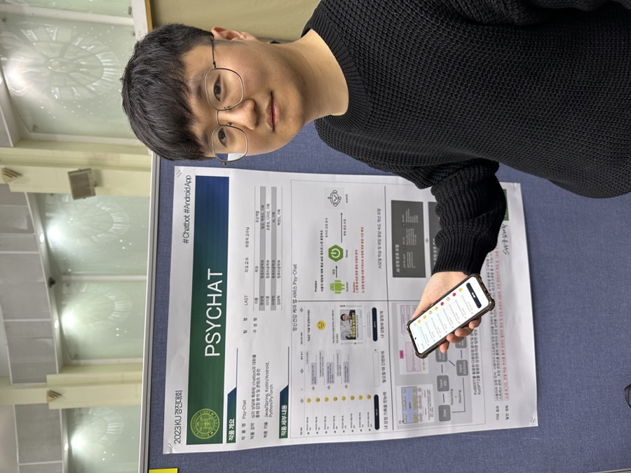

# 이지훈 Android Developer Portfolio

  

<table>
  <tr>
    <td><strong>Phone</strong> 010-2010-3068</td>
    <td><strong>Email</strong> mraz3068@gmail.com</td>
  </tr>
  <tr>
    <td><strong>GitHub</strong> <a href="https://github.com/easyhooon">github.com/easyhooon</a></td>
    <td><strong>Tech Blog</strong> <a href="https://velog.io/@mraz3068">velog.io/@mraz3068</a></td>
  </tr>
  <tr>
    <td><strong>Resume</strong> <a href="./RESUME.md">RESUME.md</a></td>
    <td><strong>LinkedIn</strong> <a href="https://www.linkedin.com/in/easyhooon/">linkedin.com/in/easyhooon</a></td>
  </tr>
</table>

## Introduce

사이드 프로젝트와 팀 프로젝트에서 **Android 앱 9개와 iOS 앱 1개**를 출시·운영하며, 지도·위치 기반 탐색, OCR 기록, 이미지 공유, 로컬 저장소 전환, CI/CD 구축처럼 사용자 경험과 운영 안정성에 직접 연결되는 기능을 구현했습니다.

출시 이후에도 사용자 피드백을 반영하고 서버 중단에 대응해 offline-first 구조로 전환하거나 Android 앱을 iOS로 확장했습니다. 반복되는 WebView 디버깅 문제는 Dari와 RoutePeek 오픈소스 라이브러리로 발전시켜 실제 서비스의 개발 환경에서 검증하고 개선했습니다.

## Team Projects

### YeoBee(여비) - 여행 비용 기록과 정산을 돕는 여행 가계부 2026.01 ~

  

여행 동행자와 함께 지출을 기록하고 공동경비·개인경비·정산 내역을 관리하는 서비스

Android 개발 · Kotlin · Jetpack Compose · Navigation3 · Metro · Multi-module · Firebase · [Play Store](https://play.google.com/store/apps/details?id=com.yeobee)

- **문제 해결**: Hilt/Dagger 기반 DI가 Android component와 KSP 생성 코드에 묶여 있어 멀티 모듈 graph 경계와 ViewModel 생성 경로를 프로젝트가 직접 통제하기 어려웠음. `AppGraph`, `DataScope`, `ActivityRetainedScope`, 프로젝트 소유 qualifier, MetroX ViewModel factory를 정의하고 Hilt Gradle plugin·compiler·annotation을 제거해 Metro 기반 DI로 전환
- **성과**: 앱·data layer·activity-retained scope의 dependency lifetime과 contribution 위치를 명시하고, `metroViewModel()` / `assistedMetroViewModel()` 기반 ViewModel 생성 경로로 통일해 기능 모듈 확장 시 DI 규칙을 문서화된 컨벤션으로 유지
- **문제 해결**: 초대 수락 버튼 클릭 시점에 서버 상태를 변경하면 사용자가 이름 선택 화면에서 이탈했을 때 서버에는 수락 완료 상태가 남고 클라이언트 플로우는 끝나지 않는 불일치가 발생할 수 있었음. 초대장 조회 단계에서는 만료·중복 참여를 사전 검증하고, 이름 선택 완료 시점에만 최종 수락 API를 호출하도록 플로우를 재설계
- **성과**: 딥링크·수동 코드 입력·비로그인 진입·warm start 경로에서도 동일한 초대 수락 흐름을 유지하고, 만료/중복/정원 마감/여행 삭제 케이스를 일관된 에러 UI로 처리
- **문제 해결**: 공동 가계부에서 단체 여행 여부, 공동경비 예산 존재 여부, 개인/공동 항목 타입, 정산 방식이 섞이면서 추가·수정·상세·통계 화면 간 금액 표시 기준이 달라질 위험이 있었음. `LedgerType`과 `ExpenseType`을 분리하고 최신 동행자 정보를 재조회해 기존 항목 복원, 균등/커스텀 분배, 공동경비 결제자 옵션 노출 기준을 정리
- **성과**: 공동경비 예산, 개인 지출, 공동 지출, 정산 상세, 통계 상세의 금액 표시와 검증 기준을 통일해 여행 비용 기록·정산 흐름의 예외 케이스를 줄임
- **문제 해결**: Firebase App Distribution과 Play Store 배포 과정에서 versionCode 관리와 릴리즈 노트 작성이 반복 작업으로 남아 있었음. Firebase 배포 스크립트와 Play Store 배포 workflow, versionCode override, Discord 알림 흐름을 정리
- **성과**: QA 배포와 운영 배포 전 검증 과정을 자동화해 반복 배포 작업의 실수를 줄이고, 최신 앱 버전 운영 속도를 높임

### Reed(리드) - 문장과 감정을 함께 담는 독서 기록 2025.05 ~ 2026.04

  

독서 중 만난 문장과 감정을 함께 기록하고 공유하는 서비스

Android 파트 리드 · Kotlin · Jetpack Compose · Circuit(MVI) · Multi-module · Firebase · **YAPP 26기 최우수상**

- Google 권장 아키텍처와 Circuit(MVI) 기반 프로젝트 구조 및 상태 관리 방식 설계
- Version Catalog와 Gradle Convention Plugin 기반 멀티 모듈 구조 최적화
- 커스텀 Pagination 기반 도서 검색·상세 조회 화면 구현
- DataStore 기반 최근 검색어, 온보딩, 자동 로그인 기능 구현
- Circuit Navigation 기반 Type-safe 네비게이션 시스템 구현으로 복잡한 객체 전달과 시작 화면 동적 변경 지원
- 로그인 없이 앱을 먼저 체험할 수 있는 Guest Mode 구현
- 도서 기록 카드 저장·공유 기능과 Firebase Remote Config 기반 앱 버전 관리 시스템 구현
- GitHub Actions, GitHub Secret, Firebase App Distribution 기반 CI/CD 파이프라인 구축
- ktlint, detekt 기반 정적 코드 분석 자동화와 Debug/Release 환경 분리
- Google Drive APK 수동 배포 흐름을 Firebase App Distribution 링크 기반 QA 프로세스로 전환
- OCR 지원과 도서 기록 템플릿 제공으로 사용자가 수기로 입력해야 하는 부분을 줄여 기록 피로도 완화
- 팀원에게 Circuit 도입 필요성과 장점을 설명하며 Android 구조 설계와 기술 선택을 리딩

### 유니페스 : 대학 축제의 지도를 펼쳐라! 2024.03 ~ 2025.10

  

대학 축제 통합 플랫폼으로 지도 기반 행사 정보, 부스 웨이팅, QR 인증 이벤트, 알림 기능을 제공하는 서비스

Android 개발 · Kotlin · Jetpack Compose · Naver Map Compose · MVI · Room · [Play Store](https://play.google.com/store/apps/details?id=com.unifest.android)

고려대·가천대·상명대·한국교통대 축제 공식 앱 선정, Play Store 다운로드 **2,000+**, Android/iOS 통합 **WAU 5,000+**

- Naver Map Compose 기반 지도 화면 구현, 위치 권한·커스텀 마커·클러스터링 적용
- 구글 권장 아키텍처와 MVI 패턴 기반 모듈 구조 설계
- QR 기반 부스 행사 참여 인증 기능 구현
- Room과 DataStore를 활용한 관심 축제, 관심 부스, 사용자 설정 관리
- Type Safe Compose Navigation 적용으로 화면 전환과 데이터 전달 안정성 확보
- Firebase Remote Config 기반 강제 업데이트와 API 커스텀 에러 처리 적용
- GitHub Actions와 Firebase App Distribution 기반 CD 파이프라인 구축
- Room Migration Test 도입으로 데이터베이스 스키마 변경 안정성 확보
- Naver Map Compose 클러스터링 적용으로 축제 지도 내 부스·행사 정보 가독성 개선
- 대학 총학생회와 협업해 실제 축제 운영 환경에서 공식 앱으로 사용
- 테스터 QA 배포 흐름을 자동화해 앱 설치와 검증 과정을 단순화

### 트립메이트 - 강원도 여행 정보 및 동행 찾기 2024.06 ~ 2024.11

강원도 여행 동행 플랫폼으로 현위치 기반 여행지 탐색, 개인 여행 스타일 분석, 동행 매칭을 제공하는 서비스

Android 앱 개발 · Kotlin · Jetpack Compose · Clean Architecture · MVI · Kakao Map · Room · [Play Store](https://play.google.com/store/apps/details?id=com.tripmate.android) · [GitHub](https://github.com/TeamTripmate/tripmate-android)

한국관광공사 X 카카오 2024 관광데이터 활용 공모전 **장려상 및 강원관광재단 특별상**

- 카카오 소셜 로그인과 사용자 인증 구현
- 여행 스타일 온보딩 설문 조사, 여행 목록 필터링, 마이페이지 기능 구현
- Composable 기반 화면을 Bitmap으로 변환해 여행 스타일 이미지 공유 기능 구현
- Room 기반 관심 여행지 로컬 데이터베이스 구축
- Flow combine을 활용해 Remote/Local 좋아요 상태를 실시간 동기화
- ViewModel 스코프 내 인메모리 캐싱 전략을 적용해 카테고리 변경 시 불필요한 API 호출 감소
- 여행 카테고리 변경 시 인메모리 캐싱 전략으로 API 호출을 줄이고 화면 반응성 개선
- Compose 렌더링 메커니즘과 Canvas 처리에 대한 실무 경험 확보

### 반다라트 - 부담 없는 만다라트 계획표 2023.07 ~

  

기존 9x9 만다라트 계획표를 모바일 환경에 맞게 5x5 구조로 줄인 목표 관리 앱

Android 개발 · Kotlin · Jetpack Compose · Compose Multiplatform · Circuit(MVI) · Room · [Play Store](https://play.google.com/store/apps/details?id=com.nexters.bandalart.android) · [GitHub](https://github.com/Nexters/BandalArt-Android) · **다운로드 1,000+**

- Jetpack Compose 기반 반다라트 계획표 Custom UI 구현과 공통 컴포넌트 정의
- Clean Architecture와 MVVM 구조를 MVI 기반 구조로 전환하고 Circuit 도입
- now in android 기반 feature 모듈 구조와 Gradle Convention Plugin 적용
- 반다라트 계획표 CRUD, 게스트 로그인, 온보딩, 목표 달성 화면 구현
- 서버 API 의존 구조를 Room 로컬 저장소 기반 offline-first 구조로 전환해 서버 중단 이후에도 서비스 유지
- Android 앱을 Compose Multiplatform으로 마이그레이션해 iOS 앱까지 배포
- Google Play In-App Update API 적용으로 업데이트 유도 흐름 제공
- Room Database, Repository, ViewModel 테스트 코드와 GitHub Actions CI 도입
- Circuit 도입으로 상태 관리와 이벤트 처리 복잡도 감소
- 사용자 피드백 기반 사용성·성능 개선을 지속하며 운영 경험 확보
- 태블릿·가로 모드 대응을 통해 다양한 화면 환경에서 사용성 개선

### I'Lab - 나만의 AI 프로필 연구소 2024.01 ~ 2024.04

  

생성형 AI 기반으로 취향에 맞는 프로필 사진을 만들고 공유할 수 있는 카메라 앱

Android 앱 개발 · Kotlin · Jetpack Compose · Clean Architecture · Orbit(MVI) · Firebase · [Play Store](https://play.google.com/store/apps/details?id=com.nexters.ilab.android) · [GitHub](https://github.com/Nexters/ilab-android)

- Clean Architecture와 MVI 패턴 기반 프로젝트 구조 설계
- Orbit 기반 단방향 데이터 흐름과 UI 상태 관리 구조 구현
- Version Catalog와 Gradle Convention Plugin 기반 멀티 모듈 구조 최적화
- 카카오 소셜 로그인, 카메라·앨범 기반 사진 업로드, 스타일 선택, AI 이미지 생성 및 공유 기능 구현
- Kotlin Result와 runCatching 기반 네트워크 에러 처리 표준화
- GitHub Actions, ktlint, detekt 기반 CI와 정적 코드 분석 자동화
- Orbit 도입으로 상태 관리 효율성과 이벤트 처리 예측 가능성 향상
- Gradle Convention Plugin 적용으로 모듈 간 빌드 설정 중복 제거
- MaterialTheme 기반 다크모드 지원과 복구 가능한 에러 UI로 앱 안정성 보완

## Other Projects

### 이끔 2023.07 ~ 2024.04

  

카페에서 공부하는 사용자를 위한 맞춤 카페 탐색 앱

Android 개발 · Kotlin · Naver Map · Flow · Paging

- 페이징 API 결과를 Naver Map에 마킹하고 검색 결과와 지도 상태를 연결
- Flow flatMapLatest 기반으로 검색 조건 변경 시 최신 검색 결과만 반영
- 검색어 디바운스와 Navigator 모듈을 도입해 검색 경험과 화면 전환 구조 개선

### 나나공 2021.09 ~ 2023.04

  

인강 수강 독려 서비스 앱

Android 개발 · Kotlin · MVVM · Hilt · Flow · FCM

- MVVM·Hilt 기반 구조를 도입하고 LiveData 중심 흐름을 Flow로 전환
- Navigation 기반 Single Activity 구조로 화면 전환 책임을 정리
- FCM 기반 주기적 알림으로 수강 독려 경험 제공

| 프로젝트 | 기간 | 설명 | 주요 기여 |
| --- | --- | --- | --- |
| GalleryApp | - | 갤러리 앱 | 이미지 목록과 상세 화면 구성, 로컬 미디어 접근 경험 확보 |
| MyVoca | - | 영어 단어 학습 앱 | 단어장 CRUD와 학습 흐름 구현 |
| PsyChat | - | 정신 건강 케어 앱 서비스 | 상담·채팅형 기능 구현 경험 |
| 도서 검색 앱 | - | 도서 검색 기능 중심 앱 | 검색 API 연동과 목록·상세 UI 구성 |
| 카카오 미디어 검색 앱 | - | 카카오 미디어 검색 API 기반 앱 | 외부 API 연동과 검색 결과 UI 구성 |
| Buddy Call | - | 커뮤니케이션 앱 | 앱 화면 구조와 기본 기능 구현 |
| Traveler | - | 여행 일정 관리 앱 | 여행 일정 생성·관리 기능 구현 |

## Libraries

### Dari - WebView Bridge Inspector

Web ↔ App JavaScript Bridge 메시지의 요청·응답·상태를 기기에서 실시간으로 확인하는 Android 디버깅 라이브러리

Kotlin · Jetpack Compose · WebView Bridge · Room · [GitHub](https://github.com/easyhooon/dari) · [개발 배경](https://velog.io/@mraz3068/Android-WebView-Debugging-with-Dari-Library-Introduction) · [운영 적용 및 고도화](https://velog.io/@mraz3068/Improving-Dari-Library)

- **개발 배경**: HTTP 통신은 Chucker로 요청과 응답을 쉽게 확인할 수 있지만, 표준화된 도구가 없는 WebView Bridge는 Logcat에서 흩어진 로그를 직접 찾고 짝지어야 했음. 호출이 빈번하거나 IDE를 연결할 수 없는 환경에서는 문제 재현이 어렵고, 프론트엔드 개발자와 실패 지점을 공유하기도 힘든 상황이 반복됨
- **핵심 구현**: 브릿지 레이어에 Interceptor를 연결해 Web-to-App/App-to-Web 메시지를 함께 수집하고, 핸들러·상태별 검색과 필터링, Request/Response 매칭, JSON 포매팅, 복사·공유 기능을 제공. Persistent Notification과 Dynamic Shortcut으로 앱 밖에서도 최근 통신과 디버그 패널에 접근하도록 구성
- **운영 검증과 고도화**: 실제 운영 서비스의 개발 환경에 적용한 뒤 인메모리 로그 유실, 단방향 이벤트, 다중 WebView 로그 충돌, 대용량 payload 공유 시 `TransactionTooLargeException`을 발견. Room dual-write와 보존 정책, optional request id, 브릿지별 tag, payload 길이 제한을 도입해 해결
- **사용성 개선**: 전체 로그 JSON 내보내기, 상태 필터, 다크모드, shake-to-open을 추가하고 오탐이 발생하던 흔들기 감지를 방향 반전 카운팅 방식으로 개선
- **프로덕션 안전성**: Debug 빌드에서는 통신을 기록하고 Release 빌드에서는 동일한 API의 `dari-noop` 모듈로 교체해 로그 노출과 런타임 오버헤드를 방지
- **성과**: 반복되는 사내 디버깅 문제를 재사용 가능한 오픈소스 도구로 전환하고, 직접 사용하는 서비스에서 발견한 예외 상황을 다시 라이브러리 개선으로 연결하는 개발·검증 사이클 구축

### RoutePeek - WebView Route Inspector

WebView의 현재 route와 SPA route 변경을 Compose overlay로 확인하는 Android 디버깅 라이브러리. 웹뷰 화면의 현재 경로를 앱 안에서 바로 확인해 라우팅 이슈 재현과 공유를 쉽게 개선.

Kotlin · Jetpack Compose · WebView · [GitHub](https://github.com/easyhooon/routepeek)

## Troubleshooting

### WebView Renderer 종료 후 사진 업로드 흐름 복구

실무 · Android · WebView · Crashlytics

- **문제**: 특정 기기에서 카메라 촬영 후 앱으로 복귀하면 앱이 재시작된 것처럼 보이고, 촬영한 사진의 업로드 흐름이 중단됨
- **원인 분석**: Crashlytics에 Fatal 로그가 없는 점에서 앱 프로세스와 WebView Renderer 종료를 분리해 추적. `onRenderProcessGone()`에 WebView 버전·URL·가용 메모리·`didCrash`를 Non-Fatal로 수집해 카메라 실행 중 메모리 압박으로 Renderer가 시스템에 의해 종료된 사실을 확인
- **해결**: 앱 전체 재시작 로직을 제거하고 WebView를 재생성·복원. 네이티브는 촬영 요청과 결과를 ViewModel의 pending state로 보관하고, 웹은 request id와 진행 상태를 TTL이 있는 `localStorage`에 저장한 뒤 bridge ready 시 결과를 재전달하도록 설계
- **결과**: Renderer가 종료되어 JS 메모리와 callback이 유실되어도 사용자가 진행하던 사진 요청을 복원해 업로드를 완료할 수 있는 흐름 구축

[기술 기록](https://velog.io/@mraz3068/Camera-WebView-Crash-Troubleshooting)

### WebView 업데이트 이후 Safe Area 이중 적용 해결

실무 · Android · WebView · Chromium · Edge-to-edge

- **문제**: 앱과 웹을 배포하지 않았는데 일부 기기에서 상·하단 여백이 갑자기 추가되어 전체 UI가 압축되는 현상 발생
- **원인 분석**: Chromium WebView 버전별 동작과 Android 16 edge-to-edge 변경을 조사해, 과거 `0px`이던 `env(safe-area-inset-*)`가 실제 시스템 바 높이를 반환하기 시작하면서 네이티브가 주입하던 inset과 충돌한 것을 확인
- **해결**: Android는 버전과 관계없이 `--safe-area-inset-*` CSS 변수를 주입하고, 웹은 `var(--safe-area-inset-top, env(safe-area-inset-top))` 형태의 fallback으로 Android와 iOS의 처리 경로를 분리. 네이티브 화면과 WebView 화면의 padding 책임도 명확히 구분
- **결과**: 구형·신형 WebView와 iOS를 함께 지원하면서 시스템 바 침범과 inset 이중 적용을 방지

[기술 기록](https://velog.io/@mraz3068/Android-WebView-safe-area-insets-%EC%9D%B4%EC%8A%88top-bottom-inset-%EC%B6%94%EA%B0%80-%EC%A0%81%EC%9A%A9)

### 하이브리드 앱의 백그라운드 음악 재생 구조 설계

실무 · Android · WebView Bridge · Media3 · MediaSession

- **문제**: Android WebView가 MediaSession을 지원하지 않고 백그라운드 진입 시 재생을 중단해, 웹 플레이어만으로는 잠금화면·알림 미디어 제어 요구사항을 충족할 수 없었음
- **의사결정**: 일정과 하이브리드 앱의 구조적 일관성을 고려해 전체 화면의 네이티브 전환 대신, 웹은 포그라운드 UI를 맡고 네이티브는 백그라운드 재생을 맡는 역할 분리 선택
- **해결**: video.js와 Media3 ExoPlayer/MediaSession 사이에 6개의 양방향 브릿지를 정의. ExoPlayer 사전 준비와 전환 경과 시간 보정으로 재생 끊김을 줄이고, 양쪽 seek·play·pause 상태를 동기화
- **결과**: 기존 웹 화면을 유지하면서 백그라운드 재생, 잠금화면·알림 컨트롤, 포그라운드 복귀 시 재생 위치 복원 지원

[기술 기록](https://velog.io/@mraz3068/Implementing-Music-Player-In-Android-Webview-Hybrid-App)

### Hilt → Metro 마이그레이션 컴파일 오류 해결

Reed · Kotlin · Metro · Multi-module · Compiler Plugin

- **문제**: 운영 중인 멀티 모듈 프로젝트를 Hilt에서 Metro로 전환하던 중, 문제 위치나 누락된 타입을 알려주지 않는 `IrErrorTypeImpl` 컴파일 오류가 발생해 마이그레이션이 중단됨
- **원인 분석**: 서명 키 없이 누구나 빌드할 수 있는 최소 재현 프로젝트를 구성하고 Metro Maintainer와 원인을 추적. Hilt는 각 모듈의 클래스패스를 개별 처리하지만 Metro는 앱 모듈에서 전체 의존성 그래프를 분석한다는 차이를 바탕으로, public API에 노출된 `Preferences` 타입이 `implementation` 의존성에 가려진 것을 확인
- **해결**: `DataStore<Preferences>`를 외부에 노출하는 모듈의 의존성을 `implementation`에서 `api`로 변경해 앱 모듈의 컴파일 클래스패스에 타입을 전이하고, 모듈 간 public API 경계를 명확히 정리
- **결과**: 컴파일 오류를 해결하고 Hilt → Metro 마이그레이션 PR을 완료. 재현 환경과 분석 내용을 공개해 동일한 오류를 추적할 수 있는 근거 제공

[기술 기록](https://velog.io/@mraz3068/Metro-Apply) · [Maintainer 논의](https://github.com/ZacSweers/metro/discussions/1358) · [Migration PR](https://github.com/YAPP-Github/Reed-Android/pull/227)

## Awards

**YAPP 26기 최우수상** 2026.04 
Reed 프로젝트 Android 파트 리드로 구조 설계·기술 스택 검토·코드 리뷰 담당

**한국관광공사 X 카카오 2024 관광데이터 활용 공모전** 2024.11 
트립메이트 앱 개발 및 출시, **장려상 및 강원관광재단 특별상 수상**

## Source

- 기존 Notion 포트폴리오: <a href="https://app.notion.com/p/b13a4ca9bef54f52b2f0c01046359dfe">Portfolio</a>
- 최신 이력서: <a href="./RESUME.md">RESUME.md</a>
